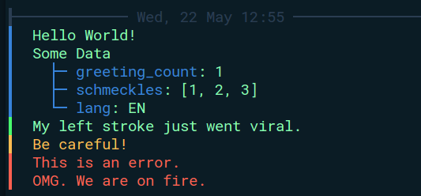
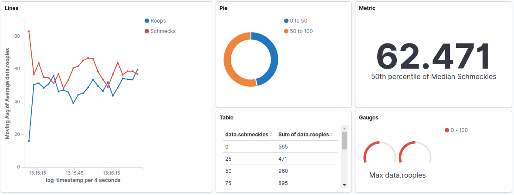

# LogKit

This is a simple logging package for Python 3.6. It wraps the native logging library with some additional features:

* Adds an additional field to each log, which can be empty, or provided with a `dict` data. It will log each key pair value with that message.
* Provides some easy default configurations for rotating file logs.
* Formats logs so that they can be easily ingested by a Logstash grok/json filter for Elasticsearch.
* Provides option to send messages directly over a TCP socket.
* Provides option to format logs with color and human readable layout.

## Quick Start Guide

Install logkit:

```bash
pip install logkit

# Or specify the PyPI index:
pip install --index-url https://pypi.org/simple/ logkit --upgrade

```

In a Python script...

```python
from logkit import log

# Log some normal information.
log.info("Hello World!")

# Add some arbitrary data.
log.info("Some Data", {"greeting_count": 1, "schmeckles": [1, 2, 3], "lang": "EN"})

# DEBUG: For extremely verbose things, that you will only need occasionally.
log.debug("My left stroke just went viral.")

# WARNING: For things that aren't breaking, but should be avoided.
log.warning("Be careful!")

# ERROR: Things that are breaking and need to be fixed.
log.error("This is an error.")

# CRITICAL: This is for something major that will cause a system failure.
log.critical("OMG. We are on fire.")
```

This is what the output looks like in **Human Readable** mode (`HUMAN_MODE=1`):



This is what the output looks like without human mode, and also in the files:

```
INFO::2019-05-17T14:01:37+0800::test_logging:14::Hello World!::{}
INFO::2019-05-17T14:01:37+0800::test_logging:17::Some Data::{"greeting_count": 1, "schmeckles": [1, 2, 3], "lang": "EN"}
DEBUG::2019-05-17T14:01:37+0800::test_logging:20::My left stroke just went viral.::{}
WARNING::2019-05-17T14:01:37+0800::test_logging:23::Be careful!::{}
ERROR::2019-05-17T14:01:37+0800::test_logging:26::This is an error.::{}
CRITICAL::2019-05-17T14:01:37+0800::test_logging:29::OMG. We are on fire.::{}
```

## Pulse: Interval Data Collection

> The `pulse` commands allow you to aggregate data over a time period. This is useful for counting number of detections over a set interval, for example.

#### Increment

```python
from logkit import pulse
pulse.increment("n_detections", 1)
```

This will increment the count of `n_detections` key by 1. The pulse will add these numbers up until it is time to emit a beat. It will then log the values through logkit, and reset all the values.

#### Gauge

```python
pulse.gauge("latency", 30.4)
```

This is similar to above, except instead of adding the values to the key, it will override it.

#### Set Interval

```python
pulse.set_interval("m", 15)  # Emit a beat one every 15 minutes.
```

Use this to configure the interval between beats.

#### Output

The output of the pulse will look like the following. The `counter` and `gauge` will be the parent object for each of the fields that you are tracking.

```
┃  ❤ Pulse ❤
┃    ├── t_from: 10 Jun 05:50
┃    ├── t_stop: 10 Jun 05:55
┃    ├─┬ counter
┃    │ └── drops: 63
┃    └─┬ gauge
┃      └── saline_level: 31
```

## Logstash Ingesting

The logs can be ingested and transformed by Logstash into Elasticsearch for more advanced visualization and record keeping.

To parse this format you will need to use this grok filter pattern:

```
"%{LOGLEVEL:log-level}::%{TIMESTAMP_ISO8601:log-timestamp}::%{GREEDYDATA:tracer}::%{GREEDYDATA:message}::%{GREEDYDATA:raw_data}"
```

Next you will also need a JSON filter to extract the data from `raw_data`:

```
json {
	skip_on_invalid_json => true
	source => "raw_data"
	target => "data"
	remove_field => "raw_data"
}
```

Also, there are several input methods to Logstash. In the Docker ELK link below, it simply exposes a TCP port on 5000. So in this package, we also have a very simple socket handler which can be enabled in the `logkit.env` file. This will cause all messages to also be sent to the socket via TCP.

If set up properly, we should be able to analyse and visualize the logging data easily from the Kibana dashboard.



Read more: [Logstash](https://www.elastic.co/guide/en/logstash/current/getting-started-with-logstash.html) | [Getting Started with ELK](https://www.elastic.co/blog/getting-started-with-elk) | [Docker ELK](https://github.com/deviantony/docker-elk) | [Logstash Input Plugins](https://www.elastic.co/guide/en/logstash/6.7/input-plugins.html)

## ENV Setup

When you first run the logger, it will look for a `logkit.env` file to set up its configuration. If it cannot find one, it will create one.

The file has the values below:

```bash
# This controls whether we should log the results to a file as well.
FILE_LOGGER__ACTIVE=1  # Either 0 or 1
FILE_LOGGER__PATH=./logs/output.log  # Where to save the log
ROTATION__INTERVAL_UNIT=d  # The unit of time to rotate the logs (d, h, m, etc).
ROTATION__INTERVAL_VALUE=1  # The value of time to rotate the logs.
ROTATION__BACKUP_COUNT=30  # How many back-ups to keep.

# If enabled, this will also send all log messages to a socket.
SOCKET_LOGGER__ACTIVE=0  # Either 0 or 1
SOCKET_LOGGER__HOST=127.0.0.1
SOCKET_LOGGER__PORT=5000

# The log level to use for the console/application and file logs.
# Values: [DEBUG, INFO, WARNING, ERROR, CRITICAL]
CONSOLE_LOG_LEVEL=INFO
FILE_LOG_LEVEL=INFO

# If enabled, this will format the terminal output to be more human readable.
HUMAN_MODE=1
```