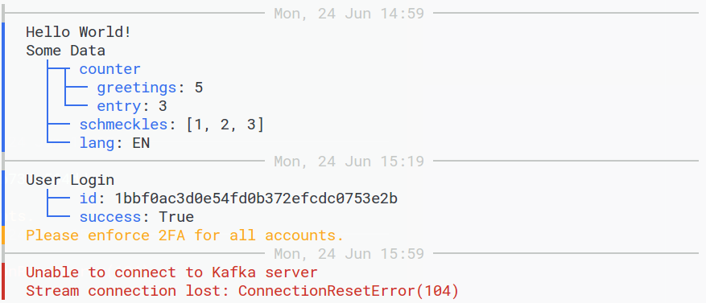

# Logkit Samples

#### Installation

```bash
pip install logkit
```

#### Usage

```python
log.info("Hello World!")

log.info("Some Data", {
	"counter": {"greetings": 5, "entry": 3},
	"schmeckles": [1, 2, 3],
	"lang": "EN"
})

log.info("User Login", {"id": uuid.uuid4().hex, "success": True, })
log.warning("Please enforce 2FA for all accounts.")

log.error("Unable to connect to Kafka server")
log.error("Stream connection lost: ConnectionResetError(104)")
```

#### Console Output



